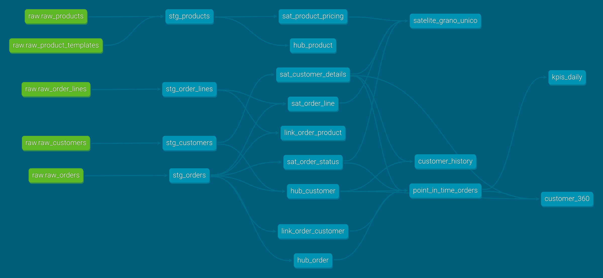
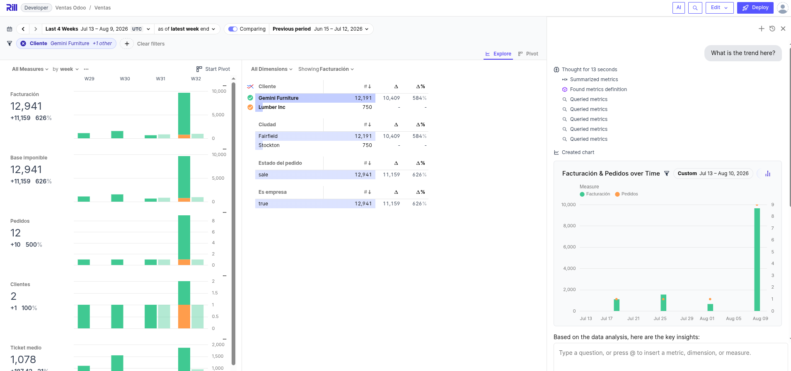

## Ejercicio: un lago de datos entero {.appendix}

El resto del libro construye sobre la secretaría académica, un origen inventado a medida para que cada capítulo pueda enseñar una cosa sin que estorben las demás. Este apéndice propone el ejercicio contrario: **partir de un sistema real y llegar hasta el panel**, con todo lo que eso trae. El origen es [Odoo](https://www.odoo.com/), un ERP de código abierto con datos de demostración, y la gracia está precisamente en que su base de datos no está diseñada para que la analicemos.

Todo lo necesario está en el repositorio. Basta con este apéndice y los ficheros que se citan para reconstruirlo desde cero, y conviene hacerlo en ese orden, porque cada paso deja algo que el siguiente necesita.

:::{.callout-note}
# Es un ejercicio aparte

Este montaje no continúa el ejemplo de la academia ni comparte nada con él. Los puertos están elegidos para que ambos puedan convivir en la misma máquina, así que se puede tener el libro renderizando y este lago levantado a la vez.
:::

## Lo que se va a levantar

Cinco piezas, todas de código abierto, cada una haciendo exactamente un trabajo.

```{mermaid}
flowchart LR
    o[("Odoo<br/>PostgreSQL")] --> d["dlt"]
    d --> b[("DuckDB<br/>raw")]
    b --> t["dbt"]
    t --> v[("DuckDB<br/>vault")]
    v --> t2["dbt"]
    t2 --> g[("DuckDB<br/>oro")]
    g --> r["Rill"]

    classDef origen fill:#ececf0,stroke:#868d9c,stroke-width:1.5px,color:#2b2f3a
    classDef carga fill:#fae3c8,stroke:#bf7f28,stroke-width:1.5px,color:#573809
    classDef almacen fill:#d5e6f5,stroke:#3d7cb0,stroke-width:1.5px,color:#12354e
    classDef transformacion fill:#d7eddc,stroke:#4a9463,stroke-width:1.5px,color:#1c4a2e
    classDef explotacion fill:#e6ddf5,stroke:#7457bd,stroke-width:1.5px,color:#332757
    class o origen
    class d carga
    class b,v,g almacen
    class t,t2 transformacion
    class r explotacion
```

| Pieza | Papel | Dónde queda |
|---|---|---|
| Odoo 16 y PostgreSQL 15 | Sistema origen con datos de demostración | `http://localhost:8069` |
| dlt | Ingesta de Odoo al almacén | `pipelines/odoo_extract.py` |
| DuckDB | El almacén, las cuatro capas | `warehouse/warehouse.duckdb` |
| dbt | Data Vault y capa de explotación | `dbt_project/` |
| Rill | Panel de exploración | `http://localhost:9010` |

: Las piezas del ejercicio y dónde encontrarlas

Los puertos no son los de costumbre y la razón es evitar choques: el 3000 lo usa Evidence en el [capítulo de inteligencia de negocio](../explotacion/bi.qmd), el 8585 lo ocupa OpenMetadata en el [apéndice de metadatado](metadatado.qmd) y el 9009 es el de un Rill arrancado en local como se ve en el [apéndice de exploración](rill.qmd). Aquí PostgreSQL se publica en el 5433 y Rill en el 9010.

## Antes de empezar

Hace falta Docker con el complemento `compose`, unos 4 GiB de memoria libre y unos 3 GiB de disco, casi todo para la imagen de Odoo. La primera ejecución tarda lo que tarde la descarga.

## Puesta en marcha

### Levantar el origen

```bash
docker compose up -d
```

Esto arranca PostgreSQL, crea la base de datos de Odoo con el módulo de ventas y sus datos de demostración, y deja el ERP escuchando. La creación de la base de datos la hace un servicio de un solo uso (`odoo-init`) en lugar del asistente web, que es lo que suele proponerse y que tiene el inconveniente de no ser reproducible: obliga a rellenar un formulario a mano y a acordarse de marcar la casilla de los datos de demostración.

El primer arranque tarda un par de minutos en inicializar la base. Se sabe que ha terminado cuando el servicio de inicialización ha salido con código cero:

```bash
docker inspect dl-odoo-init --format '{{.State.ExitCode}}'
```

A partir de ahí Odoo responde en `http://localhost:8069`, con usuario `admin` y contraseña `admin`. Merece la pena entrar y mirar los pedidos de venta, aunque solo sea para tener presente cómo se ven los datos antes de que los toquemos.

### Cargar la capa bronce

```bash
docker compose run --rm extract
```

dlt lee cinco tablas de Odoo y las deja en el esquema `raw` sin más cambio que el nombre. Al terminar informa de lo cargado, y estos son los números que salen con los datos de demostración:

```
raw.raw_customers: 40
raw.raw_orders: 20
raw.raw_order_lines: 44
raw.raw_products: 34
raw.raw_product_templates: 29
```

Si esos números no cuadran, no tiene sentido seguir: algo ha fallado en el origen y todo lo que venga después heredará el problema.

### Construir el vault

```bash
docker compose run --rm transform
```

dbt encadena las tres capas que quedan (staging, vault y explotación) y a continuación ejecuta las pruebas. La salida termina así:

```
Done. PASS=74 WARN=0 ERROR=0 SKIP=0 TOTAL=74
```

Las setenta y cuatro incluyen diecisiete modelos y cincuenta y siete pruebas. Que pasen todas no significa que el modelo sea bueno, pero que falle una sí significa que algo está mal, y en este proyecto hay pruebas puestas justo donde el Data Vault se rompe con más facilidad.



### Las dos cosas de una vez

Los dos pasos anteriores pueden ejecutarse como un solo proceso, porque dlt sabe lanzar un proyecto dbt por su cuenta:

```bash
docker compose run --rm pipeline
```

Está en `pipelines/run_pipeline.py` y son tres líneas de fondo: se crea el pipeline, se carga y se le pasa el mismo objeto a `dlt.dbt.package()`, que deduce de él a qué base de datos tiene que apuntar dbt. La dependencia entre cargar y transformar no hay que declararla en ningún sitio, porque si la carga lanza una excepción la línea siguiente no llega a ejecutarse.

:::{.callout-important}
# `run_all` no ejecuta las pruebas

El nombre engaña. `run_all()` hace `dbt deps`, `dbt seed` y `dbt run`, es decir el equivalente a `dbt run` y no a `dbt build`: **las pruebas de los modelos no entran**. Quedarse ahí dejaría el vault sin sus cincuenta y siete comprobaciones y sin enterarse. Por eso el script pide las pruebas aparte, con `transformacion.test()`, y suma los dos resultados antes de decidir si ha ido bien.
:::

### Explorar

```bash
docker compose --profile bi up -d rill
```

El panel queda en `http://localhost:9010`. Rill consulta el mismo fichero DuckDB que acaba de construir dbt, sin copiar nada.



:::{.callout-warning}
# Rill bloquea el almacén

DuckDB admite un único escritor sobre el fichero, por las razones que se explican en el [capítulo de bases de datos analíticas](../sistemas/dbms_analítica.qmd#embebido-o-servidor). Mientras Rill esté levantado, **cualquiera de las órdenes que escriben** (`extract`, `transform` o `pipeline`) falla con un `Conflicting lock is held in PID 0`. Ese `PID 0` despista, porque el proceso que tiene el bloqueo está en otro contenedor y desde aquí no se le ve el número.

La solución es parar el panel antes de volver a cargar:

```bash
docker compose stop rill
```

Por eso Rill vive tras un perfil de Compose y no arranca con el `up -d` general: el orden natural (cargar, transformar y después explorar) evita el choque. Al terminar de reconstruir, `docker compose --profile bi up -d rill` lo devuelve a su sitio.
:::

### Comprobar que está todo

```bash
docker compose run --rm --entrypoint python transform -c "
import duckdb
con = duckdb.connect('/data/warehouse.duckdb', read_only=True)
print(con.execute('SELECT count(*) FROM vault.hub_customer').fetchone())
print(con.execute('SELECT * FROM main.kpis_daily LIMIT 5').fetchall())
"
```

## Lo que ha quedado construido

Cuatro capas en un mismo fichero DuckDB, cada una en su esquema.

| Esquema | Capa | Contenido |
|---|---|---|
| `raw` | Bronce | Reflejo de Odoo, sin transformar (5 tablas) |
| `staging` | Preparación | Vistas que resuelven las rarezas del origen (4 vistas) |
| `vault` | Plata | 3 hubs, 2 enlaces y 4 satélites |
| `main` | Oro | `point_in_time_orders`, `kpis_daily`, `customer_360`, `customer_history` |

: Las capas del almacén y lo que hay en cada una

Que la capa de explotación viva en `main` y no en un esquema propio llamado `analytics` no es un descuido. Rill solo sabe direccionar tablas del esquema por defecto de la base de datos que adjunta (sus claves `database` y `database_schema` se ignoran con este conector), de modo que una tabla en un esquema `analytics` resulta invisible para el panel. Las capas de abajo sí van en su esquema porque solo las consume dbt. Es un ejemplo pequeño y muy típico de cómo una limitación de la herramienta de consumo acaba decidiendo dónde se materializa el dato.

## Las decisiones que importan

Cuatro cosas de este montaje merecen explicación, porque son las que separan un Data Vault que funciona de uno que parece funcionar.

### El hub se carga desde todos los orígenes

Un hub guarda claves de negocio. La tentación es sacarlas de la tabla que "es" esa entidad (los clientes, de la tabla de clientes) y ya está. Pero un pedido también nombra a un cliente, y si esa clave no estaba en la lista de contactos que hemos filtrado, el enlace apunta a un hub donde no existe y **el vault queda roto**.

Aquí `hub_customer` se carga de dos sitios a la vez:

```sql
WITH fuente AS (
    SELECT customer_id FROM {{ ref('stg_customers') }}
    UNION
    SELECT customer_id FROM {{ ref('stg_orders') }}
)
```

Esto no es una precaución teórica. Al construir el ejercicio, el filtro `customer_rank > 0` en staging dejaba fuera a los tres clientes que tienen pedidos, y la prueba `relationships` del enlace saltó con quince filas huérfanas. La razón es de las que solo se aprenden mirando: Odoo incrementa ese contador desde el flujo de su interfaz, no desde la base de datos, así que los datos de demostración (que se cargan como fixtures XML) lo dejan a cero incluso para quien tiene pedidos confirmados.

De ahí la regla, que conviene llevarse escrita: **un filtro de negocio no puede decidir qué claves existen**.

### Los satélites no se cierran, se deducen

Casi toda la literatura describe el satélite con una columna `dv_end_date` que se rellena cuando el atributo cambia, y con `NULL` para la versión vigente. Es fácil de explicar y es una mala idea de implementar, porque cerrar una fila exige un `UPDATE` sobre el histórico, que es justo lo que un vault no debe hacer nunca.

Aquí los satélites son de **solo inserción**. En cada carga se calcula la huella (`hashdiff`) de los atributos y solo se escribe si difiere de la última guardada para esa clave. La vigencia y el intervalo de validez se calculan al consultar, con una función de ventana:

```sql
lead(s.load_date) OVER (
    PARTITION BY s.hk_customer
    ORDER BY s.load_date
) AS dv_end_date
```

Si hay una carga posterior, esa es la fecha en la que la versión dejó de ser cierta. Si no la hay, la versión sigue vigente y el cierre queda a `NULL`. El resultado es el mismo que promete la teoría, y el histórico no se toca jamás. Está en el modelo `customer_history`.

### El enlace no lleva atributos

Un enlace guarda la relación y las claves de los hubs que une. Nada más. Meter la cantidad de la línea dentro del enlace pedido-producto, que es lo primero que uno hace, rompe por dos sitios: un mismo producto puede aparecer en dos líneas del mismo pedido (con lo que el par deja de ser único) y la cantidad es un atributo descriptivo, que en Data Vault va siempre en un satélite.

La solución del ejercicio es tomar la línea de pedido como grano del enlace, conservar su identificador como clave degenerada y colgar del enlace un satélite (`sat_order_line`) con cantidades y precios.

### El modelo físico de un ERP no es el que enseña

Esta es la lección que justifica usar Odoo en lugar de un origen de juguete. Lo que la interfaz presenta como un producto con su nombre y su precio, por debajo es otra cosa:

* **`product_product` no tiene nombre ni precio.** Son campos de la plantilla (`product_template`), y hay que ir a buscarlos con un `join`.
* **`product_template.name` es `jsonb`**, porque desde Odoo 16 los campos traducibles se guardan como un diccionario de idiomas. Hay que extraerlo con `json_extract_string(name, '$.en_US')`.
* **`standard_price` no existe como columna.** Vive en `ir_property`, porque depende de la compañía. Cualquier cálculo de margen tiene que ir allí.

Todo esto se resuelve en `stg_products.sql`, que es exactamente para lo que sirve la capa de staging: **absorber la rareza del origen una sola vez** para que no se propague al resto.

## Ejercicios

### Ver el historial en funcionamiento

Con una sola carga cada cliente tiene una única versión y el histórico no se aprecia. Hay que cambiar algo y volver a pasar el pipeline:

```bash
docker exec dl-postgres psql -U odoo -d odoo_demo \
  -c "UPDATE res_partner SET city='Bilbao' WHERE id=11;"

docker compose stop rill
docker compose run --rm extract
docker compose run --rm transform
```

El satélite pasa de cuarenta filas a cuarenta y una (no a ochenta: solo se escribe lo que cambió) y `customer_history` muestra la versión antigua cerrada con la fecha de la carga nueva y la nueva abierta. La consulta:

```sql
SELECT customer_name, city, dv_start_date, dv_end_date, es_version_vigente
FROM main.customer_history WHERE customer_id = 11 ORDER BY dv_start_date;
```

Conviene ejecutar `transform` una tercera vez sin tocar nada y comprobar que **no aparece ninguna fila nueva**. Si aparece, la detección por huella está mal y el histórico se llenaría de duplicados a cada carga.

### Romper la integridad a propósito

Merece la pena ver fallar la prueba que protege el vault, y el ejercicio enseña más de lo que parece porque **hacen falta dos cambios, no uno**.

El primero es el filtro que parecía inofensivo, en `stg_customers.sql`:

```sql
WHERE id IS NOT NULL
  AND customer_rank > 0
```

Con eso solo, todo sigue pasando. El hub se carga de dos orígenes, así que las claves que el filtro deja fuera entran igualmente por la puerta de los pedidos. Para romperlo hay que quitar además esa segunda fuente en `hub_customer.sql`, dejando el hub alimentado únicamente por la lista de contactos:

```sql
WITH fuente AS (
    SELECT DISTINCT customer_id FROM {{ ref('stg_customers') }}
),
```

Y hay un tercer detalle. Los hubs son de solo inserción, de modo que las claves cargadas en ejecuciones anteriores siguen ahí y tapan el problema. Hay que reconstruir desde cero:

```bash
docker compose run --rm transform dbt build --full-refresh
```

Ahora sí: `Got 15 results`, la prueba `relationships` del enlace falla y el proceso termina con código distinto de cero. Esas quince filas son pedidos que apuntan a un cliente que no existe en el hub.

La conclusión es la que interesa: el filtro por sí solo no era el fallo, y la carga multiorigen del hub no era una precaución decorativa. Cada uno tapaba al otro, y solo quitando los dos aparece el problema. Para volver atrás, basta con deshacer ambos cambios y repetir el `--full-refresh`.

### Añadir un origen

Odoo tiene facturas (`account_move` y `account_move_line`). Añadirlas es el recorrido completo: declararlas en `ODOO_TABLES` del pipeline, crear su modelo de staging, decidir si la factura es un hub nuevo o un satélite del pedido (pista: tiene identidad y vida propias) y llevarla hasta la capa de explotación.

## Lo que hay que vigilar

**Las versiones de dbt y su adaptador tienen que ir emparejadas.** Si se instala `dbt-duckdb` sin fijar también `dbt-core`, pip resuelve el núcleo más nuevo que exista y lo empareja con un adaptador viejo. Esa combinación arranca, avisa de que el plugin está desactualizado y luego **se cae de forma intermitente**, que es la peor manera de fallar. Las versiones van fijadas en `docker/toolbox.Dockerfile`.

**DuckDB escribe con un solo proceso.** Además de lo ya dicho sobre Rill, el proyecto usa un único hilo de dbt (`threads: 1`). Subirlo no acelera nada y provoca caídas cuando varios modelos escriben a la vez.

**El directorio `warehouse/` tiene que existir antes del primer arranque.** Si no está, Docker lo crea como `root` y los contenedores, que corren con el usuario del anfitrión, no pueden escribir. En el repositorio va un `.gitkeep` para que exista siempre.

## Lo que este ejercicio deja fuera

Por mantenerlo reproducible en un portátil, tres piezas se han quedado a la puerta.

**El catálogo.** OpenMetadata pide alrededor de 6 GiB solo para él y ya tiene su propio [apéndice](metadatado.qmd), con su despliegue y su puerto. Conectarlo a este almacén es un buen ejercicio adicional.

**La orquestación.** Aquí el pipeline son dos órdenes seguidas que se lanzan a mano, y para un único origen eso no pide orquestador ninguno: dlt sabe ejecutar un proyecto dbt por su cuenta (`dlt.dbt.package`), con lo que las dos órdenes se convierten en un script y la dependencia queda expresada por el propio flujo del programa. La maquinaria empieza a compensar cuando los orígenes son varios y hay que esperar a todos. Ambas cosas están en el [capítulo de herramientas de ingesta](../load/herramientas.qmd#quién-lo-pone-en-marcha).

**La exploración de verdad.** El panel que queda montado es mínimo, con una vista de métricas y un `explore`. Cómo se saca partido a Rill está en su [apéndice](rill.qmd).

## Desmontarlo

```bash
docker compose --profile bi --profile jobs down -v
rm -rf warehouse/warehouse.duckdb
```

El `-v` borra también los volúmenes, es decir, la base de datos de Odoo. Sin él, el ERP conserva sus datos y volver a levantarlo es inmediato.
